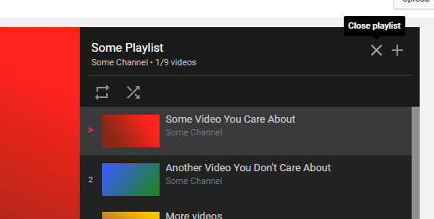

# YouTube Playlist Close

A userscript to make closing playlists easier. Keeps the video you were watching and your position in it.

To install, make sure you have [userscript support](https://greasyfork.org/en/help/installing-user-scripts) and go to [the raw script](/YouTube Playlist Close.user.js?raw=1).

You can make the button icon slightly larger or smaller by editing the script header to replace `closeMedium.png` with `closeSmall.png` or `closeLarge.png`.
